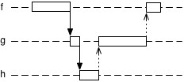
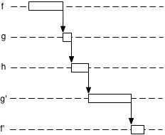

### Control Flow 对比

```js
// Direct Style
function f() {
    console.log(g());
}
function g() {
    return h();
}
function h() {
    return 123;
}
```

```js
// CPS
function f() {
    g(function (result) {
        console.log(result);
    });
}
function g(success) {
    h(success);
}
function h(success) {
    success(123);
}
```
<!-- .element: style="position:absolute; top: 4em; left: 30em" -->


<!-- .element: width="232" height="104" -->
<!-- .element: style="zoom:130%; box-shadow: none; border: none; position:absolute; top: 8.5em; left: 1.3em" -->



<!-- .element: width="232" height="190" -->
<!-- .element: style="zoom:130%; box-shadow: none; border: none; position:absolute; top: 8.5em; left: 13em" --> 


```text
Direct Style 是典型的堆栈调用流程
每一层都必须返回到上一层

CPS 的流程可以完全不受调用者控制 (控制反转)
```
<!-- .element: style="margin-top:18em; font-size: 40%" -->
<!-- .slide:  style="font-size: 75%" -->

---

### 数组搜索

```js
function searchArray(arr, searchFor, success, failure) {
    forEachCps(arr, function (elem, index, next) {
        if (compare(elem, searchFor)) {
            success(elem);  // (*) 匹配成功可以直接返回
        } else {
            next();
        }
    }, failure);
}

// 如果使用 Direct Style, 只能用 break 但不能跳出当前方法, 只能抛异常
// 考虑一下 Array.prototype.forEach 的情形，也无法终止执行
```


---

### 小结 CPS 的特性


- Callback Hell - Cons
- 对 Control Flow 有完全控制权 - Pro
- 基本不需要关键字，只需要高阶函数和递归 - Pro
  - 比如循环不需要 `while / for` 只需要 `if`
  - 异常处理不需要 `try / catch` 
  - 甚至连 `return` 都可有可无
- 更简单也更容易实现 (仅针对编译和解释器而言) - Fair
- 更强的表达能力 - Pro<br>
  所有 Direct Style 的代码都可以通过机械的变换转换为 CPS (CPS transform), 反之则不可能, (大部分情况下可转换为 coroutine)
- 强迫传染性 - Cons<br>
  CPS 的 API 无法进行封装，必须向外暴露, 然后逐层传染<br>
  这导致 Direct Style 程序如果有一个深层次的模块要换成只有 CPS 风格的库（比如数据库改为 MongoDB), 将导致大量代码需要修改

<!-- .element: style="font-size: 60%" -->

